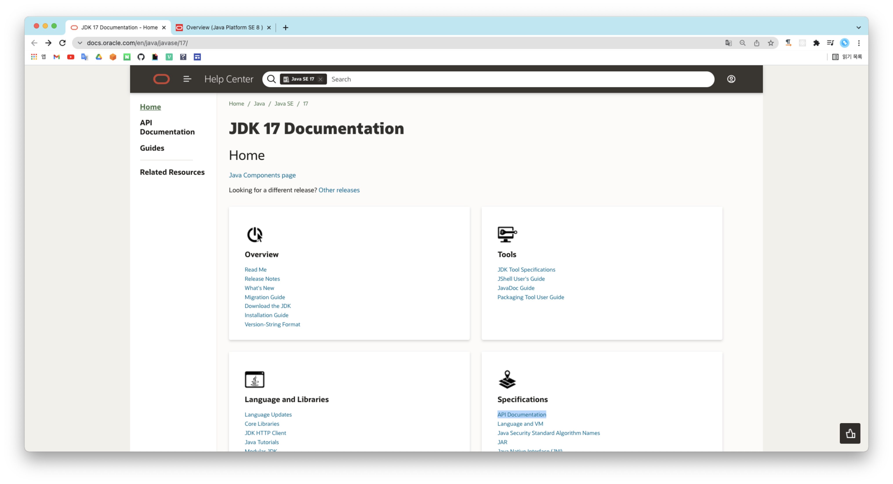
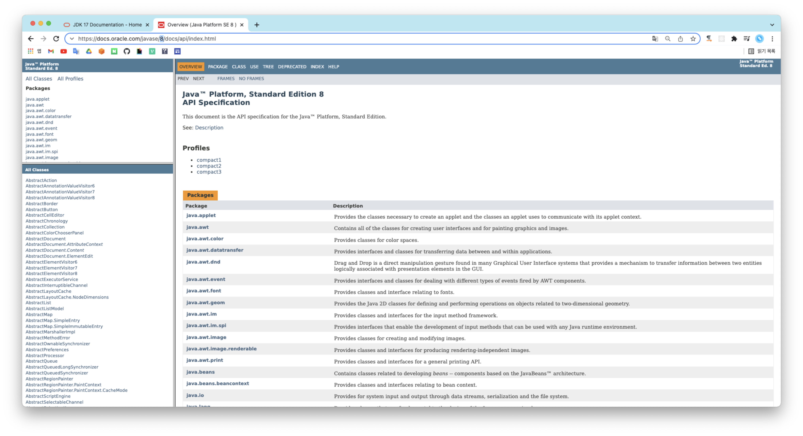
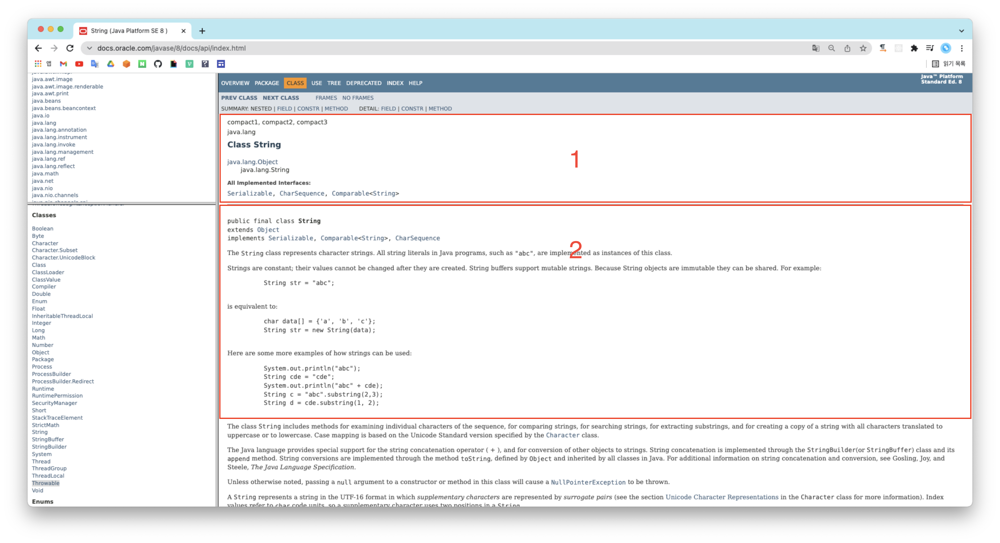

## Java Docs를 확인하는 방법을 알아보자! 🤔

JDK에 포함된 클래스들 외에 정말 많은 클래스들이 존재한다. 이 때 참조하는 문서가 API다. API(Application Programming Interface)는 애플리케이션에 선언되어 있는 클래스와 메소드에 대한 상세한 설명이 포함된 문서를 의미한다.

API 문서는 소스 내에서 클래스 및 메소드를 선언하기 전이나 후에 API에 명시되도록 하기 위한 주석만 상세하게 달아주면 만들 수 있다. 그 후 <code>javac, java</code> 명령어가 있는 "jdk/bin" 디렉터리에 있는 <code>javadoc</code> 명령어를 수행해주면 자동으로 API 문서인 HTML 파일이 생성된다.

JDK를 설치하게 되면 docs 라는 디렉터리를 확인할 수 있는데, 그 중 api 디렉터리가 API 문서이다. 하지만 굳이 압축을 해제하지 않아도 사이트를 이용할 수 있다.

- [Java의 각종 문서들을 모아둔 사이트](https://docs.oracle.com/en/java/javase/17/)



- [Java 8](https://docs.oracle.com/javase/8/docs/api/index.html)



## 문서를 확인해보자!

우선 전체적으로 정리해보자.



상단의 이미지에서 1번에 해당하는 영역을 살펴보자.

```shell
# 패키지와 클래스 혹은 인터페이스 이름
java.lang
    Class String

# 계단식 상속 관계
java.lang.Object
    java.lang.String

# 직속 자식 클래스
Direct Known Subclasses:
    (String 클래스에서는 없음)

# 인터페이스를 상속 받은 인터페이스 목록 (인터페이스만 존재)
All Known Subinterfaces:
    (String 클래스에서는 없음)

# 해당 인터페이스를 구현한 클래스들의 목록 (인터페이스만 존재)
All Known Implementing Classes:
    (String 클래스에서는 없음)

# 클래스에서 구현한 모든 인터페이스의 목록 (클래스에만 존재)
All Implemented Interfaces:
Serializable, CharSequence, Comparable<String>
```

여기서 주의 깊게 봐야하는 점은 계단식으로 표현한 상속 관계에 해당하는 정보다. 그 이유는 사용가능한 메소드가 있는데 해당 클래스의 API에 없다면 부모 클래스들의 메소드들을 살펴보아야 하기 때문이다.

다음으로는 상단의 이미지에서 2번에 해당하는 영역을 살펴보자.

```shell
# 클래스의 선언 상태
public final class String
extends Object
implements Serializable, Comparable<String>, CharSequence

# 클래스 / 인터페이스의 설명
The String class represents character strings. All string literals in Java programs, such as "abc", are implemented as instances of this class.
Strings are constant; their values cannot be changed after they are created. String buffers support mutable strings. Because String objects are immutable they can be shared. For example:

     String str = "abc";
 
(생략...)
```

여기서 잊지 말고 봐야하는 부분은 <code>Since, See also</code> 부분이다. <code>Since</code>는 해당 클래스가 JDK에 추가된 버전이 명시되어있다. 이 부분이 중요한 이유는 Java 5 버전 기반의 시스템을 만드는데 Java 6이나 7의 문서를 보고 개발을 한다면 컴파일이 제대로 되지 않는 경우가 발생할 수 있기 때문이다.

<code>See also</code>는 해당 클래스와 관련되어 있는 모든 클래스나 인터페이스, 메소드 등의 링크가 제공된다.

개발하면서 생소한 메소드가 있다면 API 문서를 확인해 해당 메소드가 언제부터 추가되어 있는지 확인하는 습관을 가지는 것이 좋다.

상단의 이미지 외의 영역들에 대해서도 정리해보자.

### 내부 클래스 종합 (Nested Class Summary)

자바는 클래스 내부에 클래스를 선언하여 사용이 가능하다. 내부 클래스를 <code>public</code>하게 선언할 경우 그에 대한 내용이 이 영역에 제공된다.

### 상수 필드 (Field Summary)

이 영역에는 클래스에 <code>public static</code> 으로 선언된 상수 필드가 제공된다. 이 값은 바귀지 않기 때문에 많이 사용되는 영역이다.

### 생성자 종합 (Constructor Summary)

클래스에 어떤 생성자들이 선언되어 있는지를 목록으로 제공한다.

### 메소드 종합 (Method Summary)

클래스에 선언된 모든 <code>public, protected</code> 메소드에 대한 종합 정보를 제공한다. 이 부분이 개발하면서 가장 많이 확인하는 영역이다. 어떤 메소드가 있는지, 반환 타입이 무엇인지, 매개 변수로는 어떤 것이 있는지에 대한 정보를 확인할 수 있다.

특이한 점은 이곳에 <code>public</code> 만이 아닌 <code>protected</code>로 선언된 메소드들이 나온다는 것이다. 그 이유는 클래스를 상속받아 자식 클래스를 개발할 때 어떤 메소드가 있는지 알아야하기 때문에 <code>public</code>만이 아닌 <code>protected</code>에 대한 메소드 정보가 필요하기 때문이다. (API 문서를 생성할 때 private 메소드도 보이도록 할 수 있다.)

### 부모 클래스로부터 상속받은 메소드들 (Methods inherited from parent)

이 영역에는 부모 클래스로부터 상속받은 메소드들이 나열된다.

### 상수 필드 상세 설명 (Field Detail)

클래스에 선언된 상수 필드가 어떤 내용을 제공하는지에 대한 상세 설명이 제공된다.

### 생성자 상세 설명 (Constructor Detail)

생성자를 어떻게 사용하고, 매개 변수에 어떤 값들이 제공되어야 하는지, 어떤 리턴 값을 제공하는지, 이 생성자에서 던지는 예외는 언제 발생하는지를 확인할 수 있다.

### 메소드 상세 설명 (Method Detail)

메소드에 대한 상세 설명이 나와있다.

## Deprecated?

Deprecated는 더 이상 사용하지 않는다는 것을 의미한다. 바로 삭제하지 않고 내버려두는 이유는 호환성때문이다. 

만약 Deprecated가 된 API를 사용할 경우 컴파일 결과 <code>Note, -Xlint:deprecation</code>를 확인할 수 있고, 나와있는 가이드에 따라 적용후 컴파일을 다시하면 <code>warning</code> 문구를 확인할 수 있다.

## Header, Footer?

문서의 최상단을 보면 <code>Overview, Package, Class, Use, Tree, Deprecated, Index, Help</code> 바를 확인할 수 있다. 간단하게 살펴보자! 😀

```
Overview: 전체 패키지에 대한 설명을 확인할 수 있다.

Package: 클래스가 속해 있는 패키지의 모든 인터페이스, 클래스, 예외 등의 목록 및 간단한 설명을 확인할 수 있다.

Class: 위에서 언급하여 생략한다.

Use: JDK에 포함되어 있는 패키지 및 클래스 중에서 현재 보고 있는 패키지, 클래스, 인터페이스 등을 사용하는 모든 목록을 나열한다. 이 부분은 처음 보는 클래스가 어디에 사용되는지 확인하고자 할 때 참고하면 좋다.

Tree: 클래스가 속한 패키지에 있는 모든 클래스들이 어떤 상속 관계를 가지고 있는지 트리 형태로 확인할 수 있다.

Deprecated: JDK에 포함된 클래스나 메소드 중 Deprecated 클래스나 메소드 목록을 확인할 수 있다.
```

```
PREV CLASS: API 목록 상에서 위에 선언된 클래스의 상세 정보로 이동한다.

NEXT CLASS: API 목록 상에서 아래에 선언된 클래스의 상세 정보로 이동한다.

FRAMES/NO FRAMES: 화면 분할 사용 유무
```