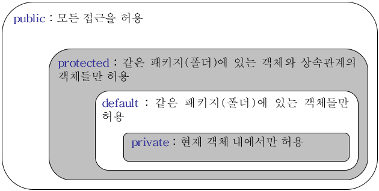

## 패키지  🤔

패키지는 자바 애플리케이션을 개발할 때 클래스들을 분류하지 않으면 이름이 중복되거나, 각 클래스가 어떤 일을 하는지 혼동되는 일이 발생하지 않도록 하기 위해 등장한 개념이다.

## 패키지 제약 사항

- 소스의 가장 첫 줄에 있어야 한다.
- 패키지 선언은 소스 하나에는 하나만 있어야 한다.
- 패키지 이름과 위치한 폴더 이름이 동일해야한다.
- 패키지 이름은 java로 시작해서는 안된다. (SecurityException - Prohibited package name: java 에러 발생)

## 패키지 명명 규칙

회사 이름이나 도메인 등은 유니크하기 때문에 사이트명으로 많이 구분한다. 주로 웹사이트 주소를 반대로 기재한 모양으로 패키지 이름을 부여를 한다. 명칭은 반드시 소문자로 이루어져야 한다.

```
com.회사명.프로그램명
com.회사명.플랫폼.프로그램명
```

## 패키지 import!

<code>import</code> 단어로 선언한 패키지에 있는 클래스를 사용하겠다는 것을 컴파일러에게 알려주게 된다. 중요한 점은, <code>import</code> 한 패키지는 컴파일이 되지 않았더라고 해당 경로에 관련 클래스의 자바 파일이 존재하면 그 클래스를 먼저 컴파일한 후 호출하는 클래스를 컴파일한다.

JDK 5 이상부터는 <code>import static</code> 이 추가가 되었다. <code>import static</code>은 static 한 변수와 메소드를 사용할 때 용이하다.

```java
import static c.javapackage.sub.SubStatic.staticMethod;
import static c.javapackage.sub.SubStatic.STATIC_VALUE;

(생략...)

STATIC_VALUE;
staticMethod();
```

<code>static</code> 키워드 없이 접근하는 것을 피하고 싶다면, "클래스명.메소드명" 형태로 호출이 가능하다.

```java
SubClass.STATIC_VALUE;
SubClass.staticMethod();
```

만약 static 메소드나 변수가 중복되는 경우에는 자신의 클래스에 있는 static 변수나 메소드가 <code>import static</code>으로 가져온 것보다 우선시된다.

> <code>java.lang</code>와 같은 패키지는 굳이 import 하지 않아도 된다.

## 내가 놓친 부분!

- 자바는 해당 패키지의 상위 디렉터리(root)에서 실행을 해야한다는 약속이 정해져있다.
- 폴더 구조상 상위 패키지에 있는 클래스와 하위 패키지에 있는 클래스의 상관관계는 자바 언어에서는 전혀 없다.

## 접근 제어자 🤔

접근 제어자는 통제하기 위해 사용된다. 예를 들어, 중요한 로직이 담겨있는 메소드를 만들었는데 다른 개발자들이 생성한 메소드를 마음대로 호출하면 안될 경우가 대표적이다. 

즉, 접근 제어자는 누구나 마음대로 사용할 수 없도록 접근을 제한하는 것을 의미한다.

변수의 경우 직접 접근해서 변수를 변경 못하게 하고 꼭 메소드를 통해서 변경이나 조회만 할 수 있도록 할 때 접근 제어자를 많이 사용한다.

접근 제어자에는 <code>public, protected, package-private(default), private</code>가 있다.



출처: https://one0.tistory.com/1

주의해야할 점은 <code>public</code>으로 선언된 클래스가 소스 내에 있다면 그 소스 파일의 이름은 <code>public</code>인 클래스 이름과 동일해야한다.

---

## 질문에 답해보자 💁‍♂️

**Q1. 패키지를 선언할 때 사용하는 예약어는 무엇인가요?**

```java
import
```

**Q2. 패키지 선언은 클래스 소스 중 어디에 위치해야 하나요?**

최상단

**Q3. 패키지를 선언할 때 가장 상위 패키지의 이름으로 절대 사용하면 안되는 단어는 무엇인가요?**

java

**Q4. 패키지 이름에 예약어가 포함되어도 되나요?**

아니요

**Q5. import는 클래스 내에 선언해도 되나요?**

아니요

**Q6. 같은 패키지에 있는 클래스를 사용할 때 import를 해야하나요?**

아니요

**Q7. 특정 패키지에 있는 클래스들을 모두 import할 때 사용하는 기호는 무엇인가요?**

```java
import c.javapackage.*
```

**Q8. 클래스에 선언되어 있는 static한 메소드나 변수를 import하려면 어떻게 선언해야 하나요?**

```java
import static c.javapackage.STATIC_VALUE;
import static c.javapackage.staticMethod();
```

<code>static</code> 키워드가 없을 경우

```java
SubClass.STATIC_VALUE;
SubClass.staticMethod();
```

**Q9. 접근 제어자 중 가장 접근 권한이 넓은 (어떤 클래스에서도 접근할 수 있는) 것은 무엇인가요?**

```java
public
```

**Q10. 접근 제어자 중 가장 접근 권한이 좁은 (다른 클래스에서는 접근할 수 없는) 것은 무엇인가요?**

```java
private
```

**Q11. 접근 제어자 중 같은 패키지와 상속관계에 있는 클래스만 접근할 수 있도록 제한하는 것은 무엇인가요?**

```java
protected
```

**Q12. "Calculate.java라는 자바 소스가 있을 경우, 그 소스 내에는 Calculate라는 클래스외에는 ( )으로 선언된 클래스가 있으면 안 된다." 여기서 괄호 안에 들어가야 하는 것은 무엇인가요?**

```java
public
```