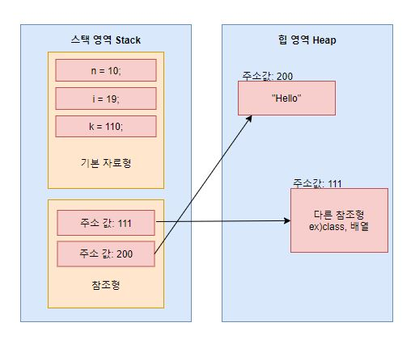

## 기본 자료형과 참조 자료형의 저장 방식?

물리적인 메모리가 아닌 프로그램에서 말하는 가상 메모리에 대해서 간략하게 설명한다면, "코드 영역, 데이터 영역, 힙 영역, 스택 영역"으로 나뉜다. 여기서 주의 깊게 봐야하는 부분은 힙 영역과 스택 영역이다.

힙 영역에는 프로그래머가 원하는 방식으로 사용할 수 있는 공간으로 긴 생명주기를 가진 데이터들이 저장된다. 반면 스택 영역은 아주 잠깐 사용하고 삭제할 데이터의 저장공간으로 변수는 모두 메모리에 저장된다. 자료형으로 넘어가보자. 👀

기본 자료형은 변수에 할당된 메모리에 바로 값이 들어가고 참조 자료형은 변수에 할당된 메모리에 객체의 주소를 저장한다. 여기서 기본 자료형은 스택 영역에 들어가고 참조 자료형의 주소값은 스택 영역에 저장되지만 값은 힙 영역에 저장된다.

## Immutable 객체?

Immutable 객체는 불변 객체로 객체 생성 이후 내부의 상태가 변하지 않는 객체다. read-only 메소드만을 제공하며, 객체의 내부 상태를 제공하는 메소드를 제공하지 않거나 제공하는 경우 방어적 복사를 통해 제공한다. 대표적으로 <code>String, Boolean, Integer, Float, Long</code> 등이 있다.

불변 객체를 만드는 방법은 간단하다. 

- 멤버변수를 <code>final</code>로 설정해준다.
- Setter 메서드를 구현해주지 않으면 된다.
- 클래스를 상속하지 못하도록 선언한다. (클래스를 <code>final</code>로 선언하거나 생성자를 <code>private</code>로 선언)
- 모든 필드가 <code>final</code>이 아닐때 즉 가변객체타입의 필드 변수가 있을 경우 그 가변객체 타입의 필드 변수에 대해 직접적으로 접근하지 못하도록 카피 객체를 생성하여 새로운 인스턴스를 반환하도록 방어적 복사본 전략을 사용한다.

객체에 대한 신뢰도는 오르고 다중 스레드 환경에서 동기화 처리 없이 객체를 공유할 수 있다(Thread-safe)는 점에서 장점을 가지지만 객체의 값이 할당될 때 마다 새로운 객체가 필요하므로 메모리 누수와 성능 저하를 발생시킬 수 있다.

## 상속과 조합의 장단점

### 상속

장점: 

- 재사용, 중복을 줄일 수 있다.
- 상위 클래스의 변경이 어렵다.
- 개발 시간이 단축된다.

단점:

- 상위 클래스와 하위 클래스가 의존하게 되어 캡슐화를 깨뜨린다.
- 의존성으로 인해 상위 클래스의 변경이 어렵다.
- 다중 상속을 지원하지 않는다.
- <code>protected</code>로 선언할 경우 변수 메소드까지 노츨되어 캡슐화가 중단된다.

사용법:

- 확장을 고려하고 설계한 확실한 <code>Is-A</code> 관계일 때 사용한다.
- API에 아무런 결함이 없는 경우에 사용한다.
- 결함이 있다면 하위 클래스까지 전파해도 괜찮을 때 사용한다.

### 조합

장점:

- 메소드를 호출하는 방식으로 동작하여 캡슐화를 깨뜨리지 않는다.
- 기존 클래스의 영향이 적어지며 안전하다.
- 구현에 의존적이지 않다. (객체의 구현이 아닌 퍼블릭 인터페이스에만 의존)
- 컴파일 타임 관계를 런타임 관계로 변경함으로서 유동적으로 문제를 해결한다. (상속은 컴파일 타임에 결정)
- 상속보다 테스트가 쉽다.
- 다중 상속에 용이하다.
- 제어 반전에 적합하고, 프록시 패턴, 데코레이터 패턴에서 종속성을 동적으로 주입할 수 있다.