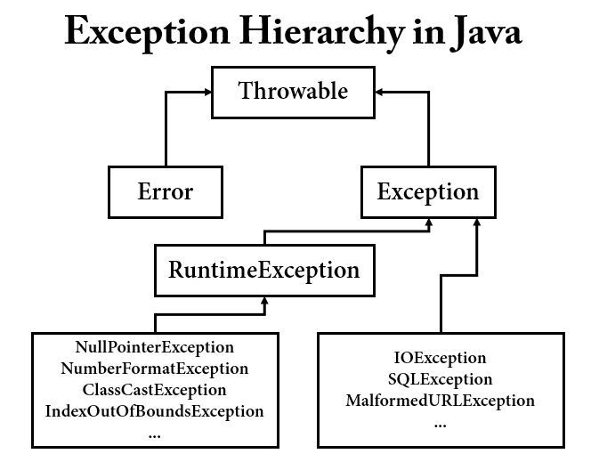

## 예외? 🤔

## System.err

우선, 나에게 생소한 메소드를 책에서 발견하게 되었는데, 이는 바로 <code>System.err</code>다. <code>System.err</code>는 콘솔 화면에서 구분이 되지 않지만, 개발 도구인 IDE에서는 출력 결과가 다른 색으로 표시된다. 책에서는 오류가 발생하는 부분에는 이 메소드를 이용하는 것을 생활화 하는 것이 좋다고 했다.

## finally 블록

많이 사용하는 <code>try-catch</code> 문에 대해서는 생략을 해도 <code>finally</code>의 용도는 알아두는 편이 좋다. 이 블록은 예외 발생 여부와 상관 없이 실행이 되는데, 코드의 중복을 피하기 위해서 반드시 필요하다고 책에서 언급을 했다.

## catch 블록의 순서

우선, <code>catch</code> 블록은 여러 개를 작성할 수 있다. 단, 주의해야하는 점은 예외 클래스의 순서다. 

하단의 코드를 예를 들자면, 로직에서 먼저 null 값인지 확인하는 작업이 먼저 수행된다. 만약 <code>ArrayIndexOutOfBoundsException</code>이 먼저 작성되어있다면, 문제가 발생하니 주의해서 사용해야한다.

그리고 마지막 블록은 <code>Exception</code> 클래스를 선언하여 예외들이 빠져 나가지 않도록 묶어주는 것이 좋다.

```java
int[] arr = new int[5];
try {
    arr = null;
    System.out.println(arr[5]);
} catch(NullPointerException e) {
    System.out.println("NullPointerException");
} catch(ArrayIndexOutOfBoundsException e) {
    System.out.println("ArrayIndexOutOfBoundsException");
} catch(Exception e) {
    System.out.println(arr);
}
```

또한 <code>catch</code> 블록에 아무런 작업 없이 공백을 두면 예외 분석이 어려워지므로 로그 처리와 같은 처리를 해주어야 한다.

## 예외의 종류

예외의 종류는 3가지로 분류된다.



출처: https://designjava.tistory.com/entry/Checked-Unchecked-Exception

- checked exception
- error
- runtime exception / unchecked exception

> error와 unchecked exception을 제외한 모든 예외는 chekced exception 이라고 생각하면 된다.

### error

에러는 자바 프로그램 밖에서 발생한 예외를 말한다. 예를 들어 서버의 디스크가 고장나서 자바 프로그램이 제대로 동작하지 않을 때를 의미한다. 자바 프로그램에 오류가 발생했을 때, 오류의 이름이 "Error"로 끝나면 에러이고 "Exception"으로 끝나면 예외다.

<code>Error</code>와 <code>Exception</code>의 가장 큰 차이는 프로그램 안에서 발생했는지, 밖에서 발생했는지 여부이고 프로그램이 멈추는지 혹은 계속 실행할 수 있는지에서 차이가 있다. 더 정확히는 <code>Error</code>는 프로세스에, <code>Exception</code>은 스레드에 영향을 준다.

### runtime exception

런타임 예외는 예외가 발생할 것을 미리 감지하지 못했을 때 발생한다. 예를 들어 <code>NullPointerException</code> 처럼 컴파일할 때 예외가 발생하지 않지만 실행시 발생할 가능성이 있는 것을 의미한다.

여기서 알 수 있듯, 컴파일시에 체크를 하지 않는다고 하여 unchecked exception이라고 부른다.

## Throwable

<code>Exception</code>과 <code>Error</code>의 공통 부모 클래스는 Object이다. 그와 동시에 <code>java.lang</code> 패키지에 선언된 <code>Throwable</code> 클래스 <code>Exception</code>과 <code>Error</code>의 부모 클래스다. 즉, <code>Exception</code>과 <code>Error</code> 클래스는 <code>Throwable</code> 클래스를 상속받아 처리하도록 되어있다. 따라서 <code>Exception</code>이나 <code>Error</code>는 <code>Throwable</code>로 처리해도 된다.

<code>Exception</code>과 <code>Error</code>는 성격이 다르지만 모두 동일한 메소드를 사용하여 처리할 수 있도록 하기 위해 상속 관계가 특이하다.

책에서는 <code>Throwable</code> 클래스에 선언되어 있고 <code>Exception</code> 클래스에서 오버라이딩한 메소드 중에서 3가지를 언급했다.

- getMessage()
- toString()
- printStackTrace()

<code>getMessage()</code>는 예외 메시지만을, <code>toString()</code>은 예외 메시지와 예외 클래스를, <code>printStackTrace()</code>는 예외 메시지와 예외가 발생하게 된 메소드들의 호출 관계를 출력해준다.

<code>printStackTrace()</code> 메소드는 유용하게 사용할 수 있지만, 이를 이용하여 운영한다면 엄청난 양의 로그가 쌓이므로 개발할 때만 사용하는 것을 권장한다.

## throw

말 그대로 던진다는 의미를 가지고 있다. <code>try-catch</code>문에서 <code>throw</code>한 것은 <code>catch</code> 블록으로 바로 이동하게 된다. 만약 해당하는 예외가 없을 경우에는 메소드 밖으로 던지게 된다. 즉, 예외가 발생한 메소드를 호출한 메소드로 던지게 된다.

이렇게 예외를 호출한 메소드로 던지는 메소드의 경우 <code>throws</code>로 예외 처리를 위임하도록 하여 불필요한 <code>try-catch</code>문을 줄일 수 있다.

```java
public void throwsException(int number) throws Exception {
    throw new Exception("number");
}
```

하지만 이렇게 <code>throws</code>로 메소드를 선언할 경우, 호출한 메소드에서 반드시 <code>try-catch</code>문으로 감싸주어야 컴파일 에러가 발생하지 않기 때문에 개발이 어려워지는 단점이 있다.

또한 이미 던져버린 예외를 다시 던지는 방법은 좋은 습관이 아니다. 가장 좋은 방법은 던지는 메소드를 호출하는 메소드에서 <code>try-catch</code>문으로 처리하는 것이 이상적이다.

## 커스텀 예외

<code>Error</code>와 관련된 클래스는 개발자가 신경쓸 필요없다. 하지만 <code>Exception</code>을 처리하는 예외 클래스는 개발자가 임의로 추가해서 만들 수 있다. 단, <code>Throwable</code>이나 그 자식 클래스를 상속을 받아야만 한다. <code>Throwable</code>을 상속받아도 되지만 <code>Exception</code>을 처리하는 클래스라면 <code>Exception</code> 클래스를 상속받는 것이 바람직하다.

만약 예외가 항상 발생하지 않고 실행시에 발생할 확률이 높을 경우에는 런타임 예외를 만드는 것이 좋다.

---

## 질문에 답해보자 💁‍♂️

**Q1. 예외를 처리하기 위한 세 가지 블록에는 어떤 것이 있나요?**

```java
try {

} catch {

} finally {

}
```

**Q2. 1의 답 중에서 "여기에서 예외가 발생할 것이니 조심하세요."라고 선언하는 블록은 어떤 블록인가요?**

```java
catch
```

**Q3. 1의 답 중에서 "예외가 발생하든 안하든 얘는 반드시 실행되어야 합니다."라는 블록은 어떤 블록인가요?**

```java
finally
```

**Q4. 예외의 종류 세 가지는 각각 무엇인가요?**

- error
- checked exception
- unchecked exception

**Q5. 프로세스에 치명적인 영향을 주는 문제가 발생한 것을 무엇이라고 하나요?**

error

**Q6. try나 catch 블록 내에서 예외를 발생시키는 키워드는 무엇인가요?**

```java
throw
```

**Q7. 메소드 선언시 어떤 예외를 던질 수도 있다고 선언할 때 사용하는 키워드는 무엇인가요?**

```java
throws
```

**Q8. 직접 예외를 만들 때 어떤 클래스의 상속을 받아서 만들어야 하나요?**

Exception, RuntimeException