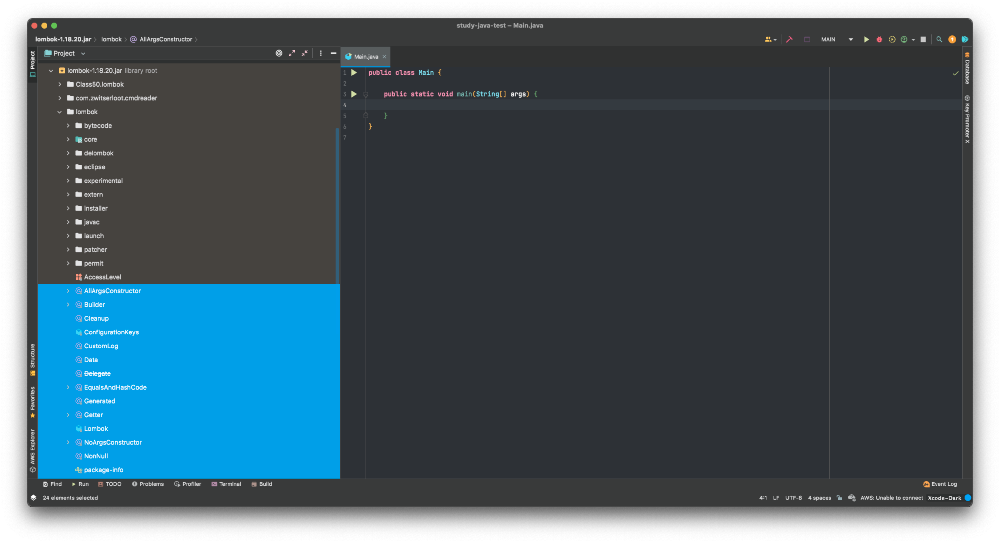

## 자바 문서는 어떤걸 기준으로 봐야하는가?

버전과는 관계없이 같이 보는 편이 좋다고 한다. 하지만 굳이 선택을 한다면 자바 8, 11, 17 기준으로 문서를 보는게 좋다는 의견이 있다. 이 중에서도 현재 내 수전에 맞게 꼭 하나만 선택을 한다면 라이선스 이슈로 인해 8에서 11로 넘어가는 추세이기에 11 문서를 추천한다고 한다.

## String의 더하기 연산에 대한 비밀

String은 연산을 수행할 때마다 새로운 객체를 생성해낸다고 공부해왔다. 하지만 실제로는 컴파일러가 자동으로 <code>StringBuilder</code>로 최적화해주기 때문에 더하기 연산을 해도 새로운 객체가 생성하지 않는다. 단, <code>for</code>문 내부에서 일어나는 더하기 연산의 경우에는 컴파일러가 판단할 수 없다.

> <code>StringBuilder, StringBuffer</code>의 <code>toString()</code> 메소드는 새로운 객체를 만들어준다.

## 내부 클래스의 메모리 누수?

내부 클래스는 주로 데이터 전달하는 용도로 많이 사용된다. 메모리 누수가 발생하는 부분은 내부 클래스가 외부 클래스에 대한 참조를 유지하고 있을 때 발생한다. 가능하면 사용하지 않는 것을 추천한다.

- [중첩, 내부 클래스 / 메모리 누수의 위험성?](https://velog.io/@maketheworldwise/%EC%A4%91%EC%B2%A9-%EB%82%B4%EB%B6%80-%ED%81%B4%EB%9E%98%EC%8A%A4-%EB%A9%94%EB%AA%A8%EB%A6%AC-%EB%88%84%EC%88%98%EC%9D%98-%EC%9C%84%ED%97%98%EC%84%B1)

## Hash? HashTable? HashCode?

해시는 단방향 암호화 기법으로 해시 함수를 이용하여 고정된 길이의 암호화된 문자열로 바꿔버리는 것을 의미한다. 가변의 길이를 고정된 길이로 변경하는데 손실이 일어나기 때문에 역으로 복호화할 수 없다는 특징을 가지고 있다.

해시 함수는 임의의 길이의 데이터를 고정된 길이의 데이터로 매핑하는 함수다. 이 때 매칭 전 원래 데이터를 키로, 매핑 후 데이터의 값을 해시 값, 매핑하는 과정을 해싱이라고 한다.

- [Hash? Hash Table? HashCode?](https://velog.io/@maketheworldwise/Hash-Hash-Table-HashCode)

## String length()

- [String의 length() 메소드는 글자 수를 세는게 아니다?!](https://velog.io/@maketheworldwise/String%EC%9D%98-length-%EB%A9%94%EC%86%8C%EB%93%9C%EB%8A%94-%EA%B8%80%EC%9E%90-%EC%88%98%EB%A5%BC-%EC%84%B8%EB%8A%94%EA%B2%8C-%EC%95%84%EB%8B%88%EB%8B%A4)

## 롬복이란?

롬복은 자바 라이브러리로 반복되는 <code>getter, setter, toString .. </code> 등의 반복 메서드 작성 코드를 줄여주는 코드 다이어트 라이브러리다.

- 어노테이션 기반의 코드 자동생성을 통한 생산성 향상
- 반복코드 다이어트를 통해 가독성 및 유지보수성 향상
- Getter/Setter 외 빌더 패턴이나 로그생성 등 다양한 방면으로 활용 가능

코딩 과정에서는 어노테이션만 보이지만, 실제로 컴파일된 결과물에서는 코드가 생성되어있는 것을 확인할 수 있다.

롬복의 <code>@Data, @toString</code> 어노테이션으로 자동 생성되는 <code>toString()</code> 메소드는 순환 참조 또는 무한재귀호출 문제로 인해 <code>StackOverflowError</code>가 발생할 수도 있다. 따라서 편리하다는 이유로 아무 생각 없이 이용하다가 여러 예외문제가 발생할 수 있다.



대부분의 롬복 어노테이션의 Target과 Retention은 다음과 같다.

- ElementType.TYPE : 타입 선언
- ElementType.FIELD : 멤버 변수 선언
- ElementType.METHOD : 메서드 선언
- RetentionPolicy.SOURCE : 컴파일 전까지만 유효 (컴파일 후에는 사라짐)

```java
@Target({ElementType.TYPE})
@Retention(RetentionPolicy.SOURCE)
public @interface AllArgsConstructor {}

@Target({ElementType.TYPE, ElementType.METHOD, ElementType.CONSTRUCTOR})
@Retention(RetentionPolicy.SOURCE)
public @interface Builder {}

@Target({ElementType.LOCAL_VARIABLE})
@Retention(RetentionPolicy.SOURCE)
public @interface Cleanup {}

@Retention(RetentionPolicy.SOURCE)
@Target({ElementType.TYPE})
public @interface CustomLog {}

@Target({ElementType.TYPE})
@Retention(RetentionPolicy.SOURCE)
public @interface Data {}

@Target({ElementType.TYPE})
@Retention(RetentionPolicy.SOURCE)
public @interface EqualsAndHashCode {}

@Target({ElementType.CONSTRUCTOR, ElementType.METHOD, ElementType.FIELD, ElementType.TYPE})
@Retention(RetentionPolicy.CLASS)
public @interface Generated {}

@Target({ElementType.FIELD, ElementType.TYPE})
@Retention(RetentionPolicy.SOURCE)
public @interface Getter {}

@Target({ElementType.TYPE})
@Retention(RetentionPolicy.SOURCE)
public @interface NoArgsConstructor {}

@Target({ElementType.FIELD, ElementType.METHOD, ElementType.PARAMETER, ElementType.LOCAL_VARIABLE, ElementType.TYPE_USE})
@Retention(RetentionPolicy.CLASS)
@Documented
public @interface NonNull {}

@Target({ElementType.TYPE})
@Retention(RetentionPolicy.SOURCE)
public @interface RequiredArgsConstructor {}

@Target({ElementType.FIELD, ElementType.TYPE})
@Retention(RetentionPolicy.SOURCE)
public @interface Setter {}

@Target({ElementType.FIELD, ElementType.PARAMETER})
@Retention(RetentionPolicy.SOURCE)
public @interface Singular {}

@Target({ElementType.METHOD, ElementType.CONSTRUCTOR})
@Retention(RetentionPolicy.SOURCE)
public @interface SneakyThrows {}

@Target({ElementType.METHOD})
@Retention(RetentionPolicy.SOURCE)
public @interface Synchronized {}

@Target({ElementType.TYPE})
@Retention(RetentionPolicy.SOURCE)
public @interface ToString {}

@Target({ElementType.TYPE})
@Retention(RetentionPolicy.SOURCE)
public @interface Value {}

@Target({ElementType.FIELD, ElementType.TYPE})
@Retention(RetentionPolicy.SOURCE)
public @interface With {}
```