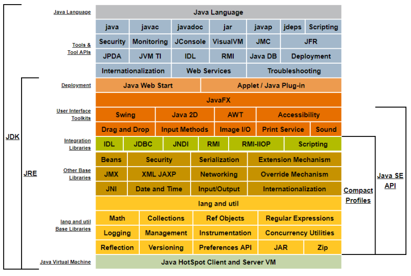
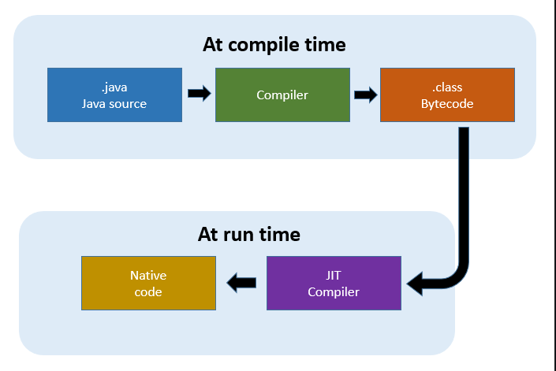
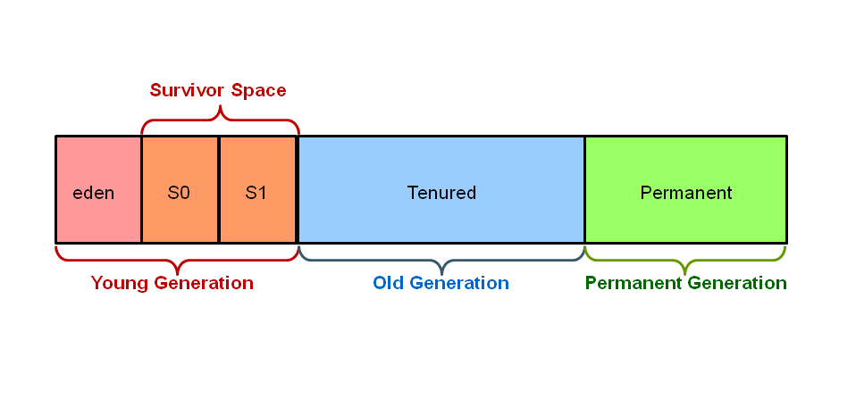

## 자바의 역사 🤔

- 1992년 Oak 언어 탄생
- 1995년 Java로 이름 변경 (Write Once, Run Anywhere (WORA)가 모토)
- 1996년 JDK 1.0 출시
- 1997년 JDK 1.1 (22만 다운로드)
- 1998년 J2SE 1.2 출시
- 2000년 J2SE 1.3 출시
- 2002년 J2SE 1.4 출시
- 2004년 J2SE 1.5 (= J2SE 5)
- 2006년 Java SE 6 출시
- 2011년 Java SE 7 출시 (Oracle이 Sun Microsystems 인수)
- 2014년 Java SE 8 출시

## 용어를 살펴보자

- JDK : Java Development Kit
- J2SE : Java 2 Standard Edition
- Java SE : Java Standard Edition
- JRE : Java Runtime Environment
- JVM : Java Virtual Machine
- GC : Garbage Collector
  
(Java SE 6 부터는 Java 2에서 2가 마케팅의 이유로 제거가 되었다.)

JVM은 작성한 자바 프로그램이 수행되는 프로세스를 의미한다. <code>java</code> 명령어로 수행한 애플리케이션은 JVM 위에서 동작한다. 자바의 메모리 관리는 개발자가 하지 않아도 JVM이 자동으로 처리해주는데, 이를 GC라고 한다.

## JDK? JRE?

JRE는 실행만을 위한 환경이다. 따라서 JRE만 설치하면 자바를 컴파일하는 등의 각종 프로그램이 제외된 상태로 설치된다.

출처: https://m.blog.naver.com/PostView.naver?isHttpsRedirect=true&blogId=saseo90&logNo=221322910150

## JDK는 플랫폼마다 다르다?

자바는 오라클에서만 만들어지는 것이 아니다. IBM, HP에서 만든 서버와 예전 Sun에서 만든 Solaris에는 각각 별도의 운영체제를 가지고 있기 때문에 해당 운영체제에 맞는 JDK를 개발하여 사용하고 있다. 즉, 각 자바 버전에서 제공되어야 하는 표준 문서가 만들어지면 그 기준에 해당하는 각 벤더에 맞는 JDK가 별도로 만들어진다.

JDK 버전만 맞다면 어느 곳이든 실행에 문제가 없으나 각 회사별 JDK의 내부 동작 구조는 상이하다.

> OpenJDK는 라이선스에 문제가 되는 부분을 제거한 완전 오픈소스 버전의 JDK를 의미한다.

## 자바 언어의 특징

### "자바는 단순하고 객체지향이며 친숙해야한다."

자바는 처음만들 때 부터 객체지향으로 디자인되어있다. 다형성, 캡슐화 등 객체지향 언어의 특징들을 지원할 수 있는 구조로 되어 있다. 또한 개발하면서 필요한 기능들은 여러 API로 이미 제공하고 있다. 대표적으로 파일 IO 라이브러리가 있다.

### "자바는 견고하며 보안상 안전하다."

자바는 컴파일할 때와 실행할 때 문법적 오류에 대한 체크를 한다. 메모리 관리 모델이 매우 단순하고 포인터 개념이 없다. 

자바는 기본적으로 분산 환경으로 디자인되어있고, 분산 환경에서는 보안이 중요한만큼 외부에서 침입이 불가능한 애플리케이션을 만들 수 있도록 해준다. 따라서 네트워크 환경에서 클라이언트로 다운로드한 승인받지 않은 프로그램은 실행할 수 없도록 되어있다. 따라서 바이러스를 생성하거나 파일 시스템을 공격할 수 없다. 간혹 JDK 내부의 오류나 라이브러리의 오류로 인해 보안 취약점이 발견되기도 한다.

### "자바는 아키텍처에 중립적이어야하며 포터블해야한다."

자바로 작성된 프로그램은 아키텍처에 중립적인 바이트 코드를 생성하기에 다양한 하드웨어 아키텍처에서 수행할 수 있다. 자바의 버전만 동일하다면 어디에서든 실행할 수 있다.

### "자바는 높은 성능을 제공해야한다."

자동화된 GC는 낮은 우선 순위의 스레드로 동작하기 때문에 보다 성능을 낼 수 있다.

### "자바는 인터프리트 언어이며, 스레드를 제공하고 동적인 언어다."

자바 인터프리터는 자바 바이트 코드를 어떤 장비에서도 수행할 수 있도록 해준다. 멀티 스레드 환경을 제공하기 때문에 동시에 여러 작업을 수행할 수 있다. 따라서 사용자에게 매우 빠른 사용 환경을 제공한다.

## 자바의 버전별 차이

중요한 부분만 살펴보자.

### JDK 1.2

JDK 1.2에서는 JIT (Just-In-Time) 컴파일러가 Sun JVM에 처음 추가가 되었다. 이 컴파일러는 어떤 메소드의 일부 혹은 전체 코드를 네이티브 코드로 변환하여 JVM에서 번역하지 않도록 하여 보다 빠른 성능을 제공하는 기술이다.

### JDK 1.3

JDK 1.3에서는 JNDI가 코어 라이브러리에 추가가 되었는데, 이는 어떤 객체를 쉽게 찾을 수 있도록 도와주는 이름을 지정한 후, 나중에 그 이름으로 객체를 찾아가는 기술이다.

### JDK 1.4

JDK 1.4에서는 정규 표현식과 NIO라는 non-blocking이 추가되었다. NIO는 이전 버전에서 제공하는 기능의 단점을 보완하기 위해 나왔으며, 기존 IO보다 어렵지만 성능은 비교할 수 없을 정도로 빠르다.

### Java 5

Java 5 이후에는 앞서 공부했던 내용과 함께 제네릭, 스레드를 처리할 수 있는 <code>concurrent</code> 패키지, 스트림이나 버퍼로 들어오는 데이터의 분석을 보다 간편하게 할 수 있는 <code>Scanner</code> 클래스가 추가되었다.

### Java 6

Java 6에서는 특별한 기능이 추가되지는 않고 안정성과 확장성을 위해 성능 개선이 되었다. (Java 7과 8에 대해서는 중요하니 교재의 뒷 부분에서 살펴보자.)

## JIT

JIT은 Just-In-Time의 약자로 동적 변환이라는 개념이라고 생각하면 된다. JIT은 프로그램 실행을 보다 빠르게 하기 위해서 만들어졌으며, 명칭은 컴파일러지만 실행시에 적용되는 기술이다.

흔히 아는 실행할 때마다 컴퓨터가 알아들을 수 있는 언어로 변환하는 인터프리트 방식은 간편하지만 성능이 느리다. 반면 정적 컴파일 방식은 실행하기 전에 컴퓨터가 알아 들을 수 있는 언어로 변환하는 작업을 미리 실행하기 때문에 변환 작업은 한 번만 이루어진다. JIT은 이 두 가지 방식을 혼합한 것으로 변환 작업은 인터프리터에 의해서 지속적으로 수행되지만 필요한 코드의 정보는 캐시(메모리)에 담아두었다가 재사용하게 된다.

<code>javac</code> 명령어로 컴파일하는 단계에서 만들어지는 <code>.class</code> 파일은 바이트 코드일 뿐이다. 즉, <code>javac</code> 명령어는 단순히 어느 곳에서도 사용할 수 있도록 만들어주는 것일 뿐이며, 컴퓨터가 알아먹을 수 있도록 다시 변환하는 작업은 JIT 컴파일러에서 수행한다.

출처: https://m.blog.naver.com/ki630808/221844888233

## HotSpot?

JDK 1.3 부터는 자바에서 HotSpot JVM이 제공된다. 자바에서는 클라이언트용 Hotspot과 서버용 HotSpot 컴파일러를 제공한다. 

클라이언트용은 CPU 코어가 하나뿐인 용자들을 위해 만들어졌다. 애플리케이션 시작 시간을 빠르게 하고 적은 메모리를 점유하도록 해준다. 반면 서버용은 코어가 많은 장비에서 애플리케이션을 돌리기 위해서 만들어졌다. 이 컴파일러는 애플리케이션 수행 속도에 초점이 맞춰져있다.

기본적으로는 자바가 시작할 때 자동으로 클라이언트인지 서버인지를 확인한다. 

- 2개 이상의 물리적 프로세서
- 2GB 이상의 물리적 메모리

이 조건을 만족하면 Oracle에서 만든 JVM은 서버 컴파일러를 선택한다. 명시적으로 지정하기 원한다면 <code>java -server</code> 옵션을 지정해주면 된다.

## GC에 대해서 더 알아보자

JVM은 Oracle 기준으로 힙 영역에서 객체를 관리한다. Young 영역에서는 젊은 객체들이 존재하며 Old 영역에는 늙은 객체들이 존재한다. Perm 영역의 경우 클래스나 메소드에 대한 정보가 쌓이게 된다.

- Eden 영역에서 객체가 생성
- Eden 영역이 가득 차면 살아있는 객체만 Survivor 영역으로 복사
- Survivor 영역이 가득 차면 다른 Survivor 영역으로 객체 복사되고, Eden 영역에 있는 객체들 중 살아있는 객체들도 같이 복사 (반드시 하나의 Survivor 영역은 비워짐)
- 오래 살이있는 객체는 Old 영역으로 이동
- Old 영역이 가득 차면 GC 발생 (메이저 GC / 풀 GC)

출처: https://memostack.tistory.com/228

영 GC와 풀 GC 중에서도 영 GC가 더 빠르다. 일반적으로 더 작은 공간이 할당되고, 객체들을 처리하는 방식도 모두 다르기 때문이다. 하지만 전체의 힙 영역을 영 영역으로 만들면 장애로 이어질 확률이 매우 높아진다.

Oracle JDK에서 제공하는 GC의 방식은 크게 Java 7 부터 추가된 G1을 포함하여 5개가 존재한다.

- Serial GC
- Parallel Young Generation Collector
- Parallel Old Generation Collector
- Concurrent Mark & Sweep Collector
- G1 (Garbage First)

이 중에서도 WAS로 사용하는 JVM에서 사용하면 안되는 것은 Serial GC다. 이 GC 방식은 클라이언트용 장비에 최적화된 GC로 <code>-client</code> 옵션을 지정했을 때 사용된다. 따라서 이 방식을 이용하면 GC 속도가 매우 느려 웹 애플리케이션이 엄청 느려진다.